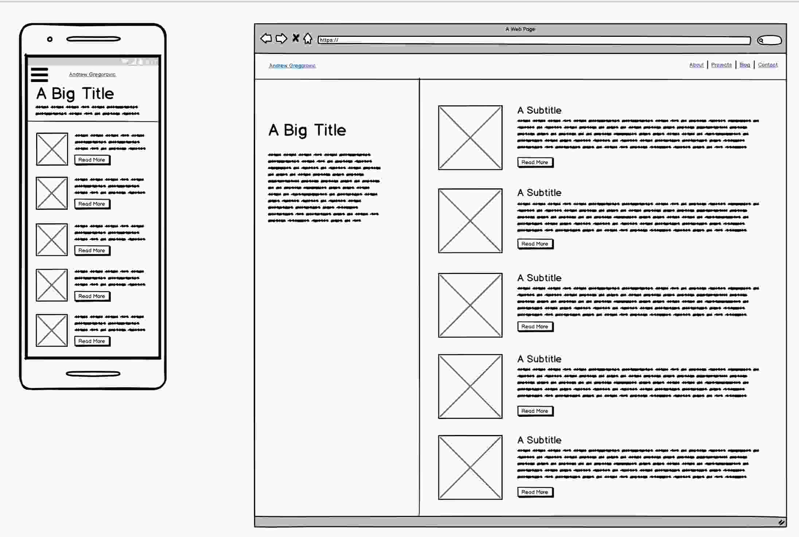
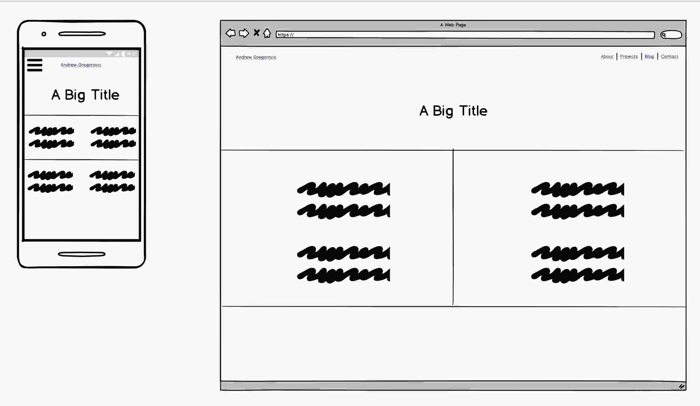
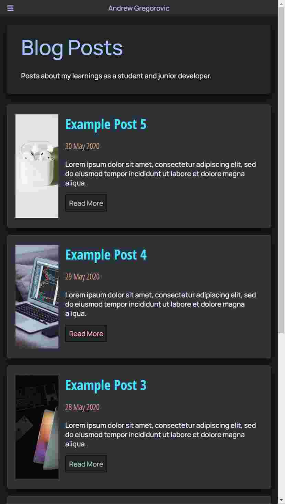

# T1A2 - Portfolio Website

## Purpose

There are two main purposes for the creation of this website:
1. To test my knowledge of HTML and CSS, display my abilitiy to use HTML and CSS to create a functioning website with multiple pages, and to broaden my knowledge as I explore how to implement different stylings and functionality in my pages.
2. To create an online space where I can promote myself to others, showcase work that I have done to show my skills and provide contact information for people trying to get in touch.

### Target audience

The main target audience for this portfolio website is anyone who is interested in seeing my work. Primarily I expect that to be potential employers however it could also include any of my peers who would like to see what I've been working on. As the website includes contact information it could also attract the attention of people simply looking for how and where they can contact me.

## Functionality / features

The pages on my portfolio website feature the following components to contain text and graphical content, provide functionality and engage visitors to my site.
- Nav Bar: The nav bar provides the main navigational functionality for the website, it is styled to be slim so that it can have fixed positioning to always be in reach for users to use. On higher resolutions the nav bar is a simple bar with all the page links visible, when scaled down to lower resolutions it changes to become a collapsible menu by using "the checkbox hack" with open and closed buttons to toggle showing the links to other pages. In both forms my name is always visisble so that users are easily able to return to the top of the index page, the "start" of my website.
- Styled Links: Links are used to allow the user to move between pages and visit other content. Where it makes sense the links change colour after being clicked to indicate to the user that they have already used that link to view its contents.
    - The tiled images on the Projects page are intended to link to the Github repositories (or similar) for each project and have an overlay on hover to increase interactivity and give the user more information to decide whether they want to look at that piece of work or not.
    - Links styled as buttons are the most used as they are more easily identified as a link and are more visually appealing than plain text links.
    - Simple text links are used when styling them as buttons doesn't feel appropriate, such as the quick links on blog post pages to view another post without having to return to the blog page listing all the articles, these have an underline on hover to improve visibility of that piece of text being a link.
- Responsive Images: Images are used where they seem appropriate to better engage viewers on the content being displayed on each page (as they say a picture is worth 1000 words) and it provided a challenge at times to get them to display and act the way I wanted them too. After managing to do that, it helps highlight how responsive the website is.
- Tooltips: Tooltips are used in places where they seem appropriate to provide further information to what an image is of or what an icon represents, some users may understand what is displayed without the help of the tooltips but it's there to help those who don't. It also provided an opportunity to play around with how to implement and style something different.
- Styled Labels/Hidden Inputs: AKA "the checkbox hack", this is used to make the nav bar collapsible at smaller resolutions, it is also used on the Index page to toggle between Personal and Professional information in the About Me section. This allows me to have display more on the page without making it any larger and adds additional interactivity with those components beyond simply clicking a link.
- Flexbox Layouts: A number of HTML containers are used to layout their children using Flexbox to provide a responsive design and achieve my desired layout.

### Sitemap

### Screenshots

Below are screenshots of the wireframes for each page followed by screenshots of the actual web pages in both browser and mobile resolutions.

##### Wireframes

##### Browser

##### Mobile

### Tech stack

The structure and content of this portfolio website was created with HTML, and the styling of all the HTML elements is done purely in CSS. It was created inside of an Ed workspace, utilising version control with Git which is integrated into the Ed workspaces.

Note: The functionality of some features and the addition of other features I contemplated implementing would require the use of Javascript as well but as that is beyond the scope of this project I made the decision to avoid anything that couldn't be done completely in HTML/CSS.

### Image Sources
- unsplash.com - source of most of the stock images used on the website.
- https://theakmalcikmat.blogspot.com/2016/03/change-default-guest-account-picture-on.html - source of the default profile image.
- https://www.teissrecruitment.com/the-black-mirror-of-programming-what-path-must-we-take-to-crack-the-code-and-find-the-hacker-teiss-cracking-cyber-security/ - source of the index page hero image.

